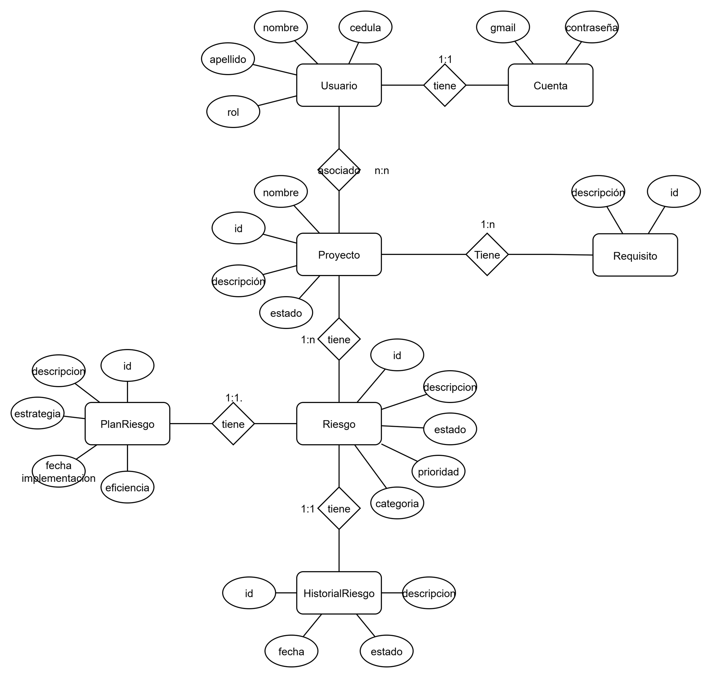

<title>INFORME DE PRÁCTICAS PREPROFESIONALES EN BASE DE DATOS</title>

Caso de Estudio: Sistema de Gestión de Riesgos (SGR) para Proyectos de Software – Universidad Nacional de Loja (UNL)

Diagrama E-R

Diagrama Relacional

