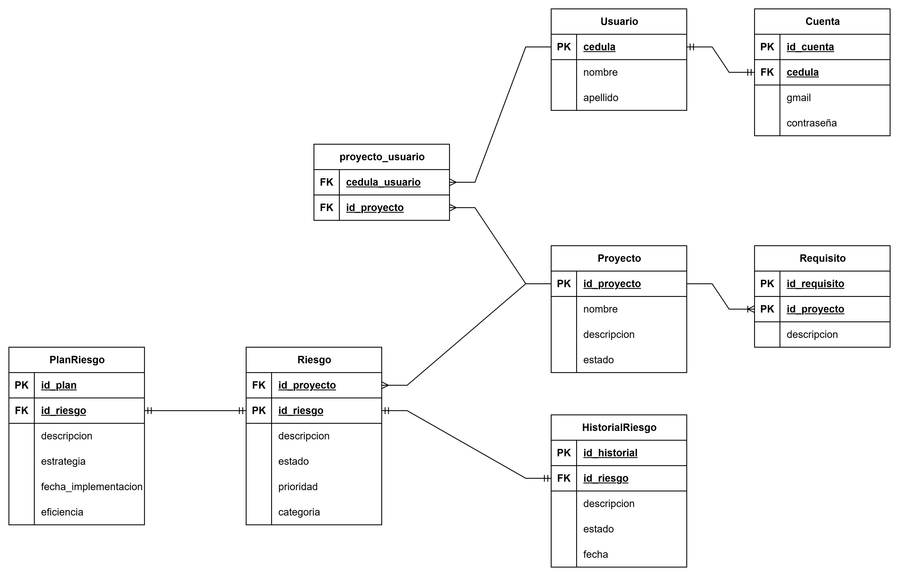

#INFORME DE PRÁCTICAS PREPROFESIONALES EN BASE DE DATOS
Caso de Estudio: Sistema de Gestión de Riesgos (SGR) para Proyectos de Software – Universidad Nacional de Loja (UNL)
Diagrama E-R

Diagrama Relacional

